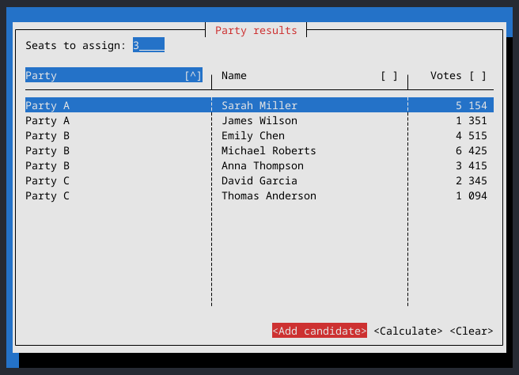
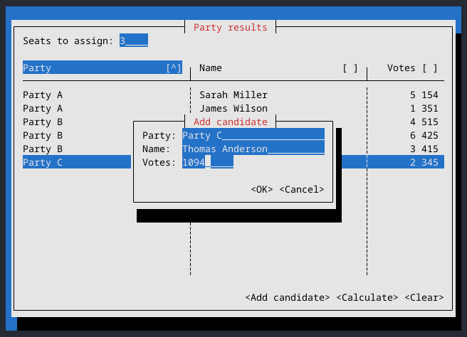
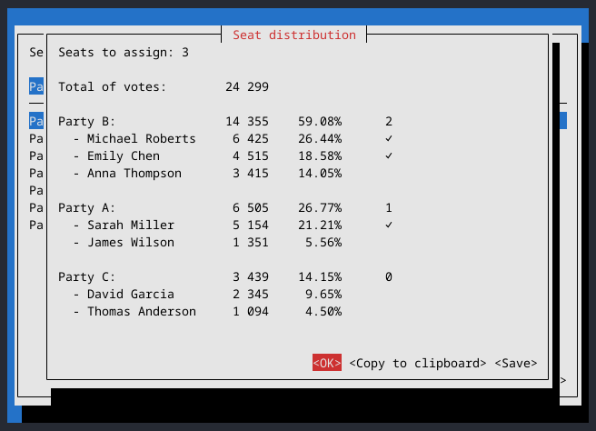

# dhondt

This a tool for calculating the seat distribution in electoral systems with proportional representation using the [D'Hondt method](https://en.wikipedia.org/wiki/D%27Hondt_method). It uses the [Cursive](https://github.com/gyscos/cursive) library to provide a TUI, though it can also accept data from a file and output it through the TUI or directly to a file.



## Building

You'll need to have a Rust compiler installed in your system to build this project.

Building the program should be as easy as running `cargo build` on the cloned repository. In Linux systems, it might be necessary to download some X Window packages to handle access to the clipboard. In an Ubuntu-like system those dependencies can be installed by running:

```console
$ sudo apt install xorg-dev libxcb-shape0-dev libxcb-xfixes0-dev
```

## Using the program

### Through the UI

After running the program with no arguments, you will see a table where the election results can be entered. Unlike some other utilities that calculate seats the D'Hondt method, you can input the individual candidate results directly and see which ones will be assigned their party seats (e.g. if a party/list gets 3 seats, the first three candidates with the most votes get a seat).



After all the data is entered, you can press the Calculate button and get a report with the results. This can be copied to the clipboard or saved to a file.



### CLI interface

This program can also be used directly through the CLI. For that, you'll need a CSV file (preferably including a header row) like this:

```csv
party,name,votes
Party A,John Doe,1340
Party A,Jane Doe,3045
Party B,Average Joe,1230
Party C,Alan Smithee,768
...
```

The program can then be run like so:

```console
$ ./dhondt -d file.csv -c 6 # Assign 6 seats from the data in file.csv
$ cargo run -- -d file.csv -c 6 # If using cargo
```

If no more arguments are provided, the UI will load with the data pre-populated. If you want to get the results directly, you can use the `-o` argument and provide a file name (or use `-` to print the output directly in `stdout`).

## Future improvements

- [ ] Save vote count data if the program is closed
- [ ] Provide binary releases through GitHub Actions
- [ ] Allow the option to input a minimum threshold for parties
